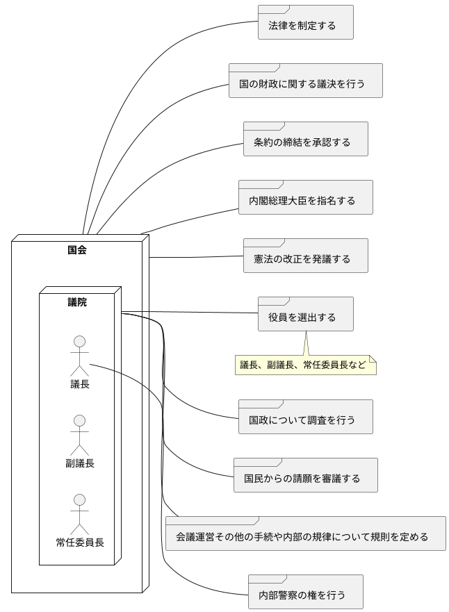
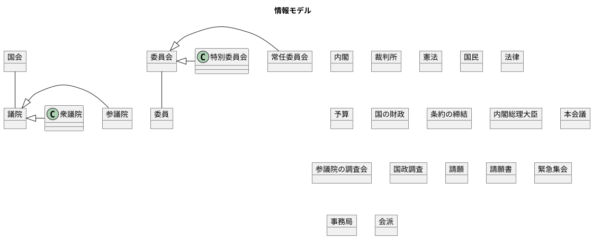

# 参議院の情報

業務コンテキスト

```plantuml
@startuml
left to right direction

node 国会 {
  node 議院 {
      actor 議長
      actor 副議長
      actor 常任委員長
  }
}
frame 法律を制定する
frame 国の財政に関する議決を行う
frame 条約の締結を承認する
frame 内閣総理大臣を指名する
frame 憲法の改正を発議する
frame 国政について調査を行う
frame 国民からの請願を審議する
frame 役員を選出する
note bottom: 議長、副議長、常任委員長など
frame 会議運営その他の手続や内部の規律について規則を定める
frame 内部警察の権を行う


' リレーション
国会 -- 法律を制定する
国会 -- 国の財政に関する議決を行う
国会 -- 条約の締結を承認する
国会 -- 内閣総理大臣を指名する
国会 -- 憲法の改正を発議する

議院 -- 国政について調査を行う
議院 -- 国民からの請願を審議する
議院 -- 役員を選出する
議院 -- 会議運営その他の手続や内部の規律について規則を定める

議長 -- 内部警察の権を行う
@enduml
```

情報モデル

```plantuml
@startuml

title: 情報モデル

object 参議院
object 国会
object 内閣
object 裁判所
object 憲法
object 国民
object 法律
object 予算
object 国の財政
object 条約の締結
object 内閣総理大臣
object 議院
object 本会議
object 委員会
object 参議院の調査会
object 国政調査
object 請願
object 請願書
object 緊急集会
object 事務局
object 委員
object 常任委員会
object 会派

' リレーション
国会 -- 議院
議院 <|- 参議院
議院 <|- 衆議院
委員会 <|- 常任委員会
委員会 <|- 特別委員会
委員会 -- 委員


@enduml
```
