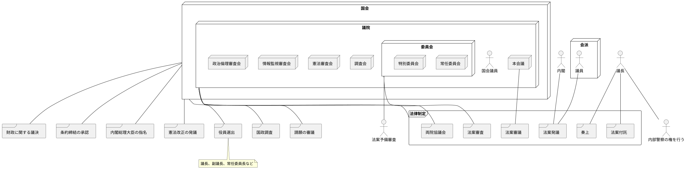
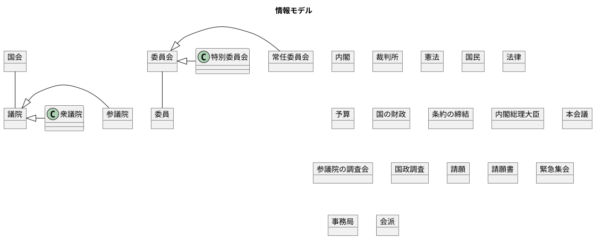

# 参議院の情報

業務コンテキスト

```plantuml
@startuml
' left to right direction

node 国会 {
  node 議院 {
    node 本会議 {
    }
    node 委員会 {
      node 常任委員会 {
      }
      node 特別委員会 {
      }
    }
    node 調査会 {
    }
    node 憲法審査会 {
    }
    node 情報監視審査会 {
    }
    node 政治倫理審査会 {
    }
    actor 国会議員
  }
}
node 会派 {
  actor 議員
}
frame 財政に関する議決
frame 条約締結の承認
frame 内閣総理大臣の指名
frame 憲法改正の発議
frame 国政調査
frame 請願の審議
frame 役員選出
note bottom: 議長、副議長、常任委員長など

frame 法律制定 {
  frame 法案発議
  frame 法案審査
  frame 法案付託
  frame 法案審議
  frame 両院協議会
  frame 奏上
}

' リレーション

' 法律制定
議員 -- 法案発議
内閣 -- 法案発議
委員会 -- 法案審査
議長 -- 法案付託
本会議 -- 法案審議
議院 -- 両院協議会
議長 -- 奏上


国会 -- 法律制定
国会 -- 財政に関する議決
国会 -- 条約締結の承認
国会 -- 内閣総理大臣の指名
国会 -- 憲法改正の発議

議院 -- 国政調査
議院 -- 請願の審議
議院 -- 役員選出

委員会 -- 法案予備審査
議長 -- 内部警察の権を行う


@enduml
```

情報モデル

```plantuml
@startuml

title: 情報モデル

object 参議院
object 国会
object 内閣
object 裁判所
object 憲法
object 国民
object 法律
object 予算
object 国の財政
object 条約の締結
object 内閣総理大臣
object 議院
object 本会議
object 委員会
object 参議院の調査会
object 国政調査
object 請願
object 請願書
object 緊急集会
object 事務局
object 委員
object 常任委員会
object 会派

' リレーション
国会 -- 議院
議院 <|- 参議院
議院 <|- 衆議院
委員会 <|- 常任委員会
委員会 <|- 特別委員会
委員会 -- 委員


@enduml
```
